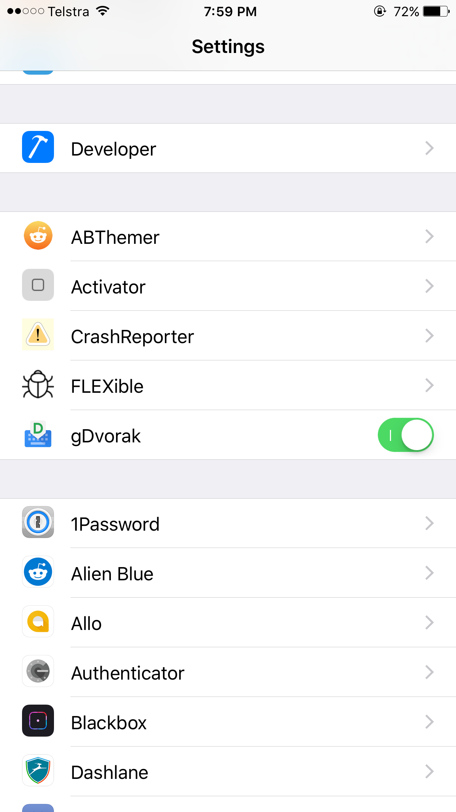
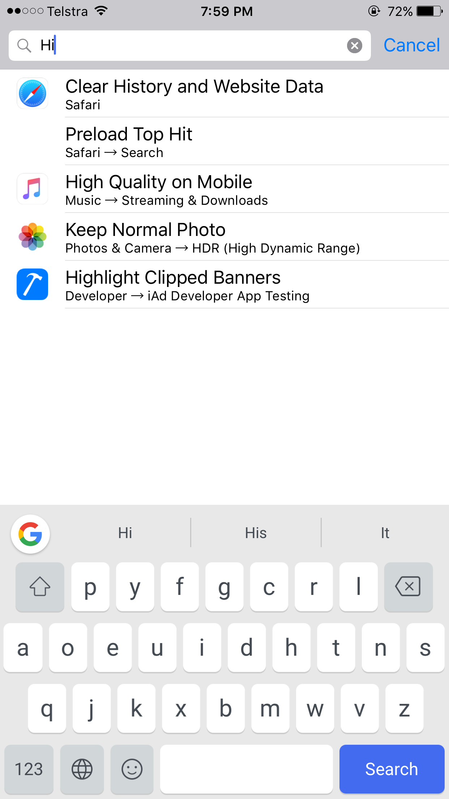

**Archived - No guarantees this code still works for current iOS versions as well as Gboard. This was written for ~iOS10.**  

# gDvorak
Dvorak keyboard layout for Gboard.

This was completed for a [request](https://www.reddit.com/r/TweakBounty/comments/53zu4v/50_dvorak_layout_for_gboard/).

Activate through settings like so:

Here's how it looks like:

# Download + info
You can download it here: https://github.com/ninjaprawn/gDvorak/releases/download/1.0/com.ninjaprawn.gdvorak_1.0_iphoneos-arm.deb

MIT License. If you want to use part of this in your own tweak/app, maybe put a small credit :)
